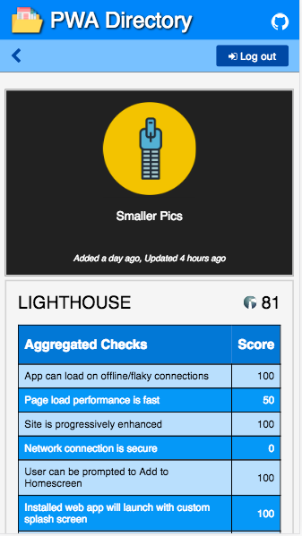

# Gulliver

[Gulliver](https://pwa-directory.appspot.com/) is a directory of [Progressive Web Apps](https://infrequently.org/2016/09/what-exactly-makes-something-a-progressive-web-app/).

## Contents

In Gulliver's landing page you can browse the set of currently registered PWAs as depicted in the following landing page snapshot:

If you click on a particular PWA, Gulliver takes you to a detail page showing the results of an evaluation done on that specific PWA using the  [Lighthouse PWA Analyzer](https://www.youtube.com/watch?v=KiV2p46rWjU) tool (Details page #1), and a view of the associated [web app manifest](https://developer.mozilla.org/en-US/docs/Web/Manifest) file  for the application (Details Page #2):

Details Page #1            |  Details Page #2
:-------------------------:|:-------------------------:
  |  

Gulliver itself has been implemented as a PWA; therefore it is designed to work well on any kind of device, including desktop web browsers (see landing page), and on mobile devices (see details page).

## FAQ

[Visit our FAQ Page](https://github.com/GoogleChrome/gulliver/blob/master/FAQ.md)

## Requirements

Gulliver was built using the [ExpressJS](https://expressjs.com/) web framework for Node.js, and uses the [Google Cloud Platform](https://cloud.google.com/) (GCP) for computing and storage services.

The following components are required to run the project (tested on macOS):

1. [NodeJS](https://nodejs.org/) (version ~6.0.0). A JavaScript runtime built on Chrome's V8 JavaScript engine. (How to verify? Run `node --version`.)

1. [Google Cloud SDK](https://cloud.google.com/sdk/). A set of tools for the Google Cloud Platform (GCP) that you can use to access the Google Compute Engine and the Google Cloud Storage, which are two components of GCP used by Gulliver. (How to verify? Run `gcloud --version`.)

1. [Memcached](https://memcached.org/). A distributed memory object caching system. (How to verify? Run `memcached` (the command should appear to hang), and then `telnet localhost 11211` in a separate terminal. In the `telnet` window, typing `version` it should report the `memcached` version. If you don't have it, see [these instructions](https://cloud.google.com/appengine/docs/flexible/nodejs/using-redislabs-memcache#testing_memcached_locally) to install memcached.)

In addition, you will need to set up a GCP project, and configure OAuth:

1. Create a [Google Cloud Platform](https://console.cloud.google.com/) project. A GCP project forms the basis of accessing the GCP. (How to verify? Run `gcloud info` and check that the `Account` and `Project` properties are what you expect. Use `gcloud init` to configure `gcloud` if you don't have one already.)

1. Get the OAuth *client id* and *client secret* associated with this project. (How to verify? There's no automatic way, but see [Creating a Google API Console project and client ID](https://developers.google.com/identity/sign-in/web/devconsole-project) for how to create one. Make sure you list `http://localhost:8080` as one of the `Authorized JavaScript origins`.)

Finally (and optionally), you need a Firebase project, and the Firebase Cloud Messaging "Server key" and "Sender ID":

1. Create a [Firebase](https://console.firebase.google.com/) project.

1. Get Firebase Cloud Messaging "Server key" and "Sender ID" associated with this project. Select "Project settings" and then "Cloud Messaging". The URL should be of the form <https://console.firebase.google.com/project/$FIREBASE_PROJECT/settings/cloudmessaging>. (How to verify? There's no automatic way, but the "Server key" should be a long string of >100 characters, and the "Sender ID" a >10 digit number.)

## Running Gulliver

1. Clone the GitHub repository: `git clone https://github.com/GoogleChrome/gulliver.git`

1. Switch into the project directory: `cd gulliver`

1. Create indexes for the [Google Cloud Datastore](https://cloud.google.com/datastore/docs/concepts/overview): `gcloud preview datastore create-indexes index.yaml`

1. (Optional) Deploy cron jobs for scheduled PWA updates: `gcloud app deploy cron.yaml`

1. Install **Memcached** and run it on `localhost:11211`. Check these [installation instructions](https://cloud.google.com/appengine/docs/flexible/nodejs/caching-application-data) for guidance.

1. Run **`npm install`** to install dependencies.

1. Configure your project either via [`config/config.json`](config/config.json) or environment variables (which override the corresponding keys in the config file).

1. Start Gulliver via `npm start`.

1. Gulliver should now be running at `http://localhost:8080`.

## Running Tests

To verify that everything is working properly you can run the project's tests:

1. `npm test` to run lint + tests + coverage report.
2. `npm run mocha` to run all the tests only.
3. `npm run coverage` to run tests + coverage report.

## Lighthouse PWA Analyzer

Gulliver reports an evaluation of the "progressiveness" of each registered PWA. This evaluation is done by Lighthouse, which is a tool that runs a set of checks validating the existence of the features, capabilities, and performance that should characterize a PWA. You can learn more about Lighthouse in the [GitHub repository](https://github.com/GoogleChrome/lighthouse), or in this [video](https://www.youtube.com/watch?v=KiV2p46rWjU).

## References

To find out more about what PWAs are and how to go about incorporating the principles of PWAs into the development of your applications, check the following references which provide introductory information and references:

+ [Progressive Web Apps](https://developers.google.com/web/#progressive-web-apps): Documentation entry point. Here you will find several resources to get started developing PWAs

+ [Progressive Web Apps: Escaping Tabs without Losing our Soul](https://infrequently.org/2015/06/progressive-apps-escaping-tabs-without-losing-our-soul/):
Introductory article with historical perspective

+ [Getting Started with Progressive Web Apps](https://addyosmani.com/blog/getting-started-with-progressive-web-apps/): Sound introduction on the fundamental elements behind the development of PWAs

+ [The Building Blocks of PWAs](https://www.smashingmagazine.com/2016/09/the-building-blocks-of-progressive-web-apps/): Interesting overall view of PWAs.

## License

See [LICENSE](./LICENSE) for more.

## Disclaimer

This is not a Google product.
